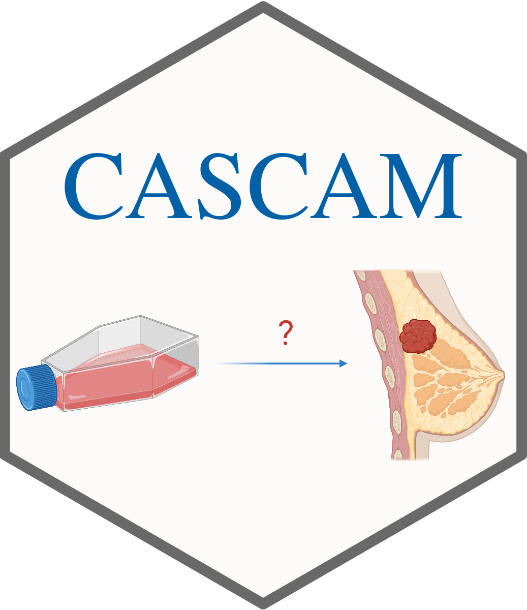
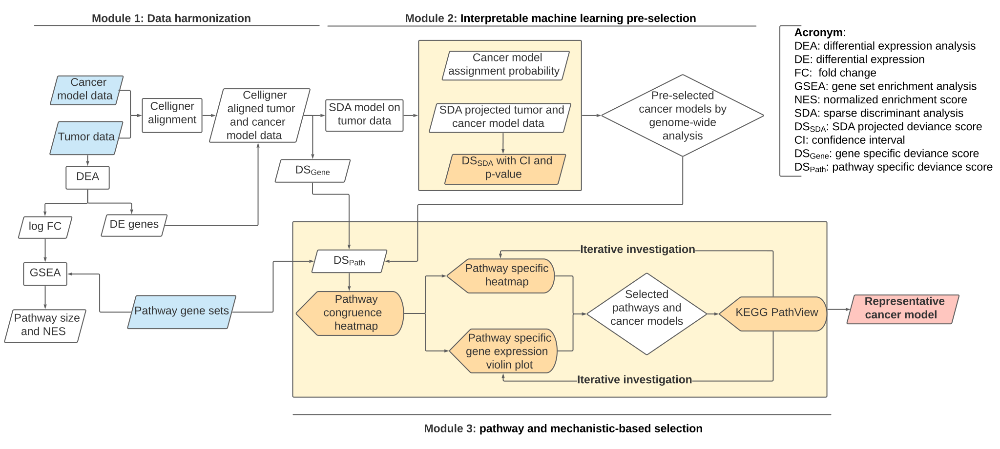

## CASCAM (Congruence Analysis and Selector of CAncer Models)

CASCAM is a R package for analyzing and selecting the appropriate cancer models (cell lines, PDOs or PDXs) 
based on the patients' tumor information. The figure below shows the framework of our method. 
Several statistics are defined to measure the distance between tumor samples and the cancer models.

  

